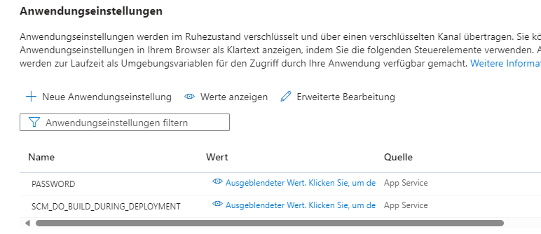

# LB 324

## Aufgabe 2
Erklären Sie hier, wie man `pre-commit` installiert.

1. Zuerst installiert man`pre-commit`

```bash
# Windows
pip install pre-commit
```

2. Danach erstellt man den Pre-Commit Hook. Beispiel:

```yaml
repos:
  - repo: local
  hooks:
  - id: pytest-check
    stages: [commit]
    types: [python]
    name: pytest-check
    entry: python -m pytest
    language: system
    pass_filenames: false
    always_run: true
```

3. Jetzt führt man noch den folgenden Befehl im Terminal aus.

```bash
pre-commit install --hook-type pre-commit --hook-type pre-push
```

Jetzt ist man Bereit und muss nichts mehr extra machen. Bei einem normalen Commit und Push wird alles Automatisch ausgeführt.

## Aufgabe 4
Erklären Sie hier, wie Sie das Passwort aus Ihrer lokalen `.env` auf Azure übertragen.

Man kann in Azure in den Anwendungseinstellungen wie in einem `.env`, seine geheimen Werte eintragen.


